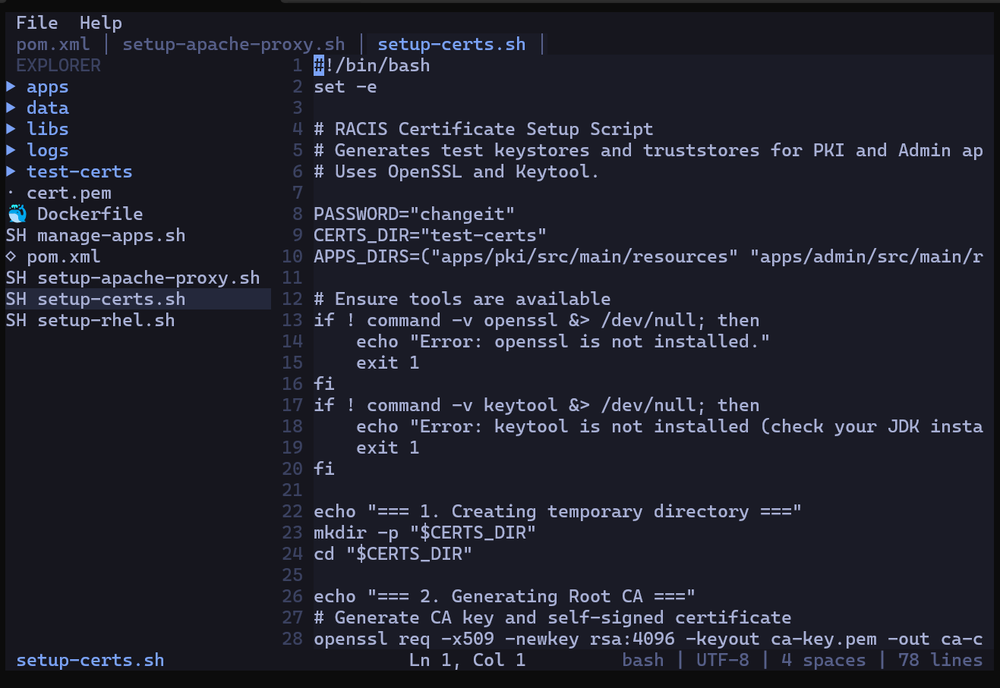

# xTerm

A terminal-based text editor and file browser built with [OpenTUI](https://opentui.com), the same TUI framework used by [OpenCode](https://opencode.ai). xTerm provides a VS Code-style editing experience entirely within the terminal.

## Features

- **File Tree Browser** - Navigate directories with an expandable/collapsible tree sidebar
- **Tabbed Editor** - Open and edit multiple files simultaneously with a tab bar
- **Syntax Highlighting** - Tree-sitter powered syntax coloring for many languages
- **Line Numbers** - Gutter with line numbers and current line highlighting
- **Search & Replace** - Find text with regex support, navigate matches, and replace
- **Undo/Redo** - Full edit history with unlimited undo
- **Copy/Cut/Paste** - Text selection with clipboard operations
- **File Operations** - Create, rename, and delete files and directories
- **Command Palette** - Quick access to all commands via keyboard
- **Dark Theme** - Tokyo Night inspired color scheme

## Screenshot



## Installation

### Quick Install (Recommended)

Install the latest pre-built binary with a single command:

```bash
curl -fsSL https://raw.githubusercontent.com/linuxdevel/xTremeTerminal/main/install.sh | bash
```

This will download the correct binary for your platform and install it to `~/.local/bin/xterminal`.

To install to a custom location:

```bash
INSTALL_DIR=/usr/local/bin curl -fsSL https://raw.githubusercontent.com/linuxdevel/xTremeTerminal/main/install.sh | bash
```

### Supported Platforms

| Platform | Architecture |
|----------|-------------|
| Linux    | x86_64, ARM64 |
| macOS    | x86_64 (Intel), ARM64 (Apple Silicon) |

### Build from Source

Requires [Bun](https://bun.sh) v1.0+ and [Zig](https://ziglang.org) (for OpenTUI's native renderer).

```bash
# Clone the repository
git clone https://github.com/linuxdevel/xTremeTerminal.git
cd xTremeTerminal

# Install dependencies
bun install

# Run directly
bun run src/index.ts

# Or build a standalone binary
bun run build
./xterminal
```

## Quick Start

```bash
# Open xTerm in the current directory
bun run src/index.ts

# Open xTerm in a specific directory
bun run src/index.ts /path/to/project

# Open a specific file
bun run src/index.ts /path/to/file.ts
```

Once launched:
1. Use **arrow keys** to navigate the file tree on the left
2. Press **Enter** to open a file in the editor
3. Start typing to edit
4. Press **Ctrl+S** to save
5. Press **Ctrl+C** to exit

## Key Shortcuts

| Shortcut | Action |
|----------|--------|
| Ctrl+S | Save current file |
| Ctrl+N | Create new file |
| Ctrl+W | Close current tab |
| Ctrl+Tab | Switch to next tab |
| Ctrl+F | Find in file |
| Ctrl+H | Find and replace |
| Ctrl+Z | Undo |
| Ctrl+Y | Redo |
| Ctrl+B | Toggle sidebar |
| Ctrl+P | File search / filter |
| F1 | Help |
| F2 | Rename file |
| Ctrl+C | Exit |

See [docs/keyboard-shortcuts.md](docs/keyboard-shortcuts.md) for the complete reference.

## Documentation

- [Getting Started](docs/getting-started.md) - Installation and first steps
- [User Guide](docs/user-guide.md) - Complete usage manual
- [Keyboard Shortcuts](docs/keyboard-shortcuts.md) - Full shortcut reference
- [Configuration](docs/configuration.md) - Theme and settings
- [Architecture](docs/architecture.md) - Technical design overview

## Tech Stack

| Technology | Purpose |
|---|---|
| [Bun](https://bun.sh) | JavaScript/TypeScript runtime |
| [OpenTUI](https://opentui.com) | Terminal UI framework |
| [Tree-sitter](https://tree-sitter.github.io) | Syntax highlighting |
| [Yoga](https://yogalayout.dev) | Flexbox layout engine |
| TypeScript | Primary language |

## Development

```bash
# Install dependencies
bun install

# Run in development
bun run src/index.ts

# Run tests
bun test

# Run specific test categories
bun test tests/unit           # Unit tests
bun test tests/component      # Component tests
bun test tests/integration    # Integration tests

# Watch mode
bun test --watch

# Coverage
bun test --coverage
```

## Project Structure

```
src/
├── index.ts              # Entry point
├── app.ts                # Main application orchestrator
├── theme.ts              # Tokyo Night color palette
├── keybindings.ts        # Keyboard shortcut definitions
├── components/           # TUI components
│   ├── layout.ts         # Main layout (sidebar + editor + bars)
│   ├── file-tree.ts      # File/directory browser
│   ├── editor.ts         # Text editor
│   ├── tab-bar.ts        # Tab bar for open files
│   ├── status-bar.ts     # Bottom status bar
│   ├── search-dialog.ts  # Find & replace overlay
│   ├── confirm-dialog.ts # Confirmation dialogs
│   └── command-palette.ts# Command palette
├── services/             # Business logic (no TUI dependency)
│   ├── file-service.ts   # File I/O operations
│   ├── tab-manager.ts    # Tab state management
│   ├── history.ts        # Undo/redo history
│   └── clipboard.ts      # Clipboard operations
└── utils/                # Pure utility functions
    ├── language-detect.ts # File extension to language mapping
    └── file-icons.ts     # Unicode icons for file types
```

## Contributing

1. Read `AGENTS.md` for coding conventions and architecture guidelines
2. Check `PROGRESS.md` for current development status
3. Read the relevant `plans/phase-*.md` for implementation details
4. Write tests for all new code
5. Run `bun test` before submitting changes

## License

GPL-3.0 -- see [LICENSE](LICENSE) for details.
